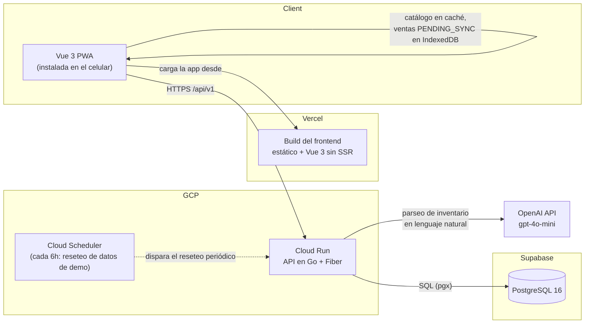

# BrewOps — demo pública

🌐 [Español](README.es.md) | [English](README.md)


Esta es la **demo pública de portafolio** de BrewOps, un sistema de gestión
de inventario, ventas y marketing construido para un pequeño negocio de
jugos y bebidas que opera en México. Los dueños llevan control de stock,
registran ventas desde una vista de punto de venta, reciben alertas de bajo
stock y administran una galería de imágenes de producto y promocionales
para WhatsApp — todo desde una PWA instalable en el celular que sigue
funcionando sin una conexión estable a internet.

Este repositorio es un fork deliberadamente separado del producto real,
armado específicamente para demos públicas, sin supervisión y repetidas.
**No** es el código que corre un negocio pagando por el producto — un
reseteo de datos programado, cuotas de uso en la función de IA y un aviso
de modo demo en el login existen solo acá, para que este repo pueda estar
en internet indefinidamente sin necesitar atención ni implicar riesgo de
costo.

## Probala

**Demo en vivo:** [brewops-demo.vercel.app](https://brewops-demo.vercel.app)

**Credenciales de acceso:**

| Email | Contraseña |
|---|---|
| `demo@brewops.mx` | `Demo2026!` |

Algunas cosas a saber antes de explorar:

- **Los datos se resetean cada 6 horas**, con un horario programado (Cloud
  Scheduler). Cualquier producto, venta o imagen que agregues o borres va a
  volver a un estado de ejemplo limpio — no trates nada de lo que cargues
  acá como persistente.
- **El asistente de inventario con IA (`/inventory/suggest`) tiene un
  límite de uso.** Cada visitante tiene una cantidad limitada de intentos
  por día, y toda la demo comparte además un presupuesto diario reducido —
  ambos límites existen únicamente para acotar el costo real de OpenAI en
  una demo pública sin muro de autenticación real. El resto de la app no
  tiene ningún límite de este tipo.
- **Cambiá de idioma con el toggle ES/EN** en la barra de navegación.
  Traduce el chrome de la app (etiquetas, botones, mensajes) — los datos de
  ejemplo en sí (nombres de productos, historial de ventas) se mantienen
  intencionalmente en español, ya que representan a un negocio mexicano
  real y traducirlos le quitaría autenticidad.
- **Instalala como app.** BrewOps es una PWA instalable — el catálogo se
  puede seguir viendo y las ventas se pueden seguir registrando sin
  conexión; todo lo que se encola offline se sincroniza automáticamente al
  reconectarte. Ver "Modo offline (PWA)" más abajo.
- Todo lo demás — inventario, ventas, el flujo del POS, alertas de bajo
  stock, reportes, la galería de marketing — se comporta exactamente igual
  que en el producto real.

¿Querés la historia completa de por qué está armado así? _(link al case
study — próximamente)_

## Stack tecnológico

Esto no es solo código guardado en un repositorio — es infraestructura real,
desplegada y funcionando: un servicio de Cloud Run en vivo respaldado por
una instancia real de Postgres en Supabase, un frontend alojado en Vercel, y
un job de Cloud Scheduler gestionado con Terraform que resetea los datos de
la demo automáticamente.

| Capa | Tecnología |
|---|---|
| Backend | Go + [Fiber](https://gofiber.io/), desplegado en GCP Cloud Run |
| Frontend | Vue 3 + Vite + TypeScript, desplegado en Vercel |
| Base de datos | PostgreSQL 16 (Supabase, hospedado) |
| Capa de queries | [sqlc](https://sqlc.dev/) — Go type-safe generado a partir de SQL crudo |
| Migraciones | [golang-migrate](https://github.com/golang-migrate/migrate) |
| Auth | JWT manual (`golang-jwt/jwt/v5`) |
| Almacenamiento de imágenes | Disco local en este despliegue, preparado para GCP Cloud Storage |
| Jobs programados | GCP Cloud Scheduler (reseteo automático de datos de demo) |
| IaC | Terraform |
| CI/CD | GitHub Actions |
| Gráficos | Chart.js vía `vue-chartjs` |
| PWA | `vite-plugin-pwa` |

## Arquitectura



## Configuración local

### Prerrequisitos

- Go 1.25+
- Node 22+ y [pnpm](https://pnpm.io/)
- Docker (para Postgres local)
- CLI de [golang-migrate](https://github.com/golang-migrate/migrate)
- CLI de [sqlc](https://sqlc.dev/)

### 1. Variables de entorno

```sh
cp backend/.env.example backend/.env
cp frontend/brew-ops/.env.example frontend/brew-ops/.env
```

Completá los valores que necesites localmente — los valores por defecto
funcionan tal cual para el Postgres que corre vía `docker-compose`. Revisá
cada `.env.example` para saber qué hace cada variable, incluyendo las de
`DEMO_*`/`VITE_DEMO_MODE` que agrega este repo sobre la configuración del
producto real.

### 2. Base de datos

```sh
docker compose up -d postgres

cd backend
migrate -path db/migrations \
  -database "$DATABASE_URL" \
  up
```

Regenerá la capa de queries type-safe después de cambiar algo en
`backend/db/queries/` o `backend/db/migrations/`:

```sh
sqlc generate
```

Cargá datos de ejemplo realistas (productos, 14 días de historial de
ventas, una galería de marketing, y la cuenta de admin de la demo) con:

```sh
cd backend
go run ./cmd/seed
```

Se puede correr de nuevo en cualquier momento sin problema — es idempotente,
borra y reinserta los datos del negocio en vez de acumularlos. Nunca toca la
identidad de la cuenta de admin de la demo, solo su contraseña, así que una
corrida repetida no invalida ninguna sesión existente.

### 3. Backend

```sh
cd backend
go run ./cmd/server
```

`GET /health` reporta el estado del servidor y la base de datos.

### 4. Frontend

```sh
cd frontend/brew-ops
pnpm install
pnpm dev
```

## Modo offline (PWA)

BrewOps está diseñado para seguir funcionando en mercados o eventos sin
internet estable: el catálogo de productos se guarda en caché mediante el
service worker (`NetworkFirst`, así que una solicitud online siempre ve los
datos más recientes — la caché es puramente el respaldo offline), y las
ventas registradas sin conexión se encolan en IndexedDB como `PENDING_SYNC`
hasta que vuelve la conectividad. Una venta que falla al sincronizar por
motivos de red se reintenta; una venta que sincroniza pero es rechazada por
reglas de negocio (por ejemplo, alguien más ya vendió la última unidad) se
muestra al usuario en vez de descartarse silenciosamente o forzarse.

### Instalar la PWA localmente

El service worker solo existe en un build de producción — el servidor de
desarrollo de `pnpm dev` nunca genera uno, así que el modo offline no se
puede probar contra él. Para instalarla y probarla localmente:

```sh
cd frontend/brew-ops
pnpm run build
pnpm run preview   # sirve dist/ en http://localhost:4173
```

Abrí `http://localhost:4173` en Chrome, y usá el ícono de instalación en la
barra de direcciones (o DevTools → Application → Manifest, que además
confirma que el manifest en sí no tiene errores). Una vez instalada,
DevTools → Network → Offline (o directamente desconectarte) te permite
confirmar: el catálogo de productos sigue siendo navegable, una venta hecha
desde el POS queda en cola como "Pendiente de sincronizar" en el historial
de ventas, y se sincroniza automáticamente al reconectar.

`CORS_ALLOWED_ORIGINS` del backend debe incluir `http://localhost:4173`
para que el servidor de preview pueda alcanzarlo — para una verificación
manual puntual, corré el backend con
`CORS_ALLOWED_ORIGINS=http://localhost:4173,http://localhost:5173 go run ./cmd/server`.

## Testing

```sh
# Backend
cd backend && go test ./...

# Tests de integración del backend (necesitan Postgres con las migraciones
# aplicadas — ver "Configuración local" más arriba)
cd backend && go test -tags=integration ./...

# Frontend
cd frontend/brew-ops && pnpm run lint && pnpm run build && pnpm run test

# End-to-end (Playwright) — requiere Postgres corriendo (docker compose up
# -d postgres); el backend y un build de producción del frontend con
# preview se levantan automáticamente. Ver el override de variables de
# entorno del backend en e2e/playwright.config.ts para el valor de
# CORS_ALLOWED_ORIGINS que usa. Cobertura profunda en inventario/stock/
# ventas, cobertura básica en login/reportes.
cd e2e && pnpm install && pnpm exec playwright install chromium && pnpm test
```

## Limitaciones conocidas

Señaladas deliberadamente, no descubiertas después — son decisiones de
alcance conscientes para una herramienta de un solo administrador para un
negocio pequeño, no bugs:

- **La cifra de "ventas del período" del dashboard no tiene un endpoint de
  agregación dedicado.** Se calcula paginando y sumando ventas del lado del
  cliente dentro de una ventana acotada, lo cual funciona bien a la escala
  real de este negocio pero no escalaría a una operación mucho más grande.
- **Los reportes de ingresos agrupan por día calendario en el huso horario
  `America/Mexico_City`**, no en UTC, para que una venta hecha entrada la
  noche caiga en el día de negocio correcto en vez de quedar dividida por
  el límite de día de UTC.
