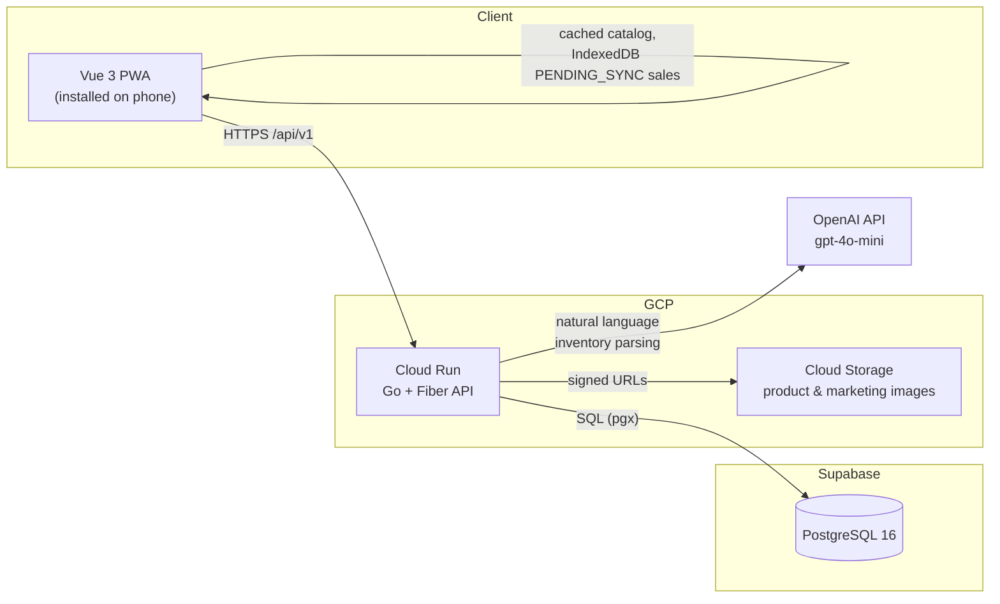

# BrewOps


Inventory, sales, and marketing management system for a small juice and
beverage business operating in Mexico. Owners track stock, record sales from
a point-of-sale view, get low-stock alerts, and manage a gallery of product
and promotional images for WhatsApp — all from a phone-installable PWA that
keeps working without a stable internet connection.

## Tech stack

| Layer | Technology |
|---|---|
| Backend | Go + [Fiber](https://gofiber.io/) |
| Frontend | Vue 3 + Vite + TypeScript |
| Database | PostgreSQL (Supabase in production) |
| Query layer | [sqlc](https://sqlc.dev/) — type-safe Go generated from raw SQL |
| Migrations | [golang-migrate](https://github.com/golang-migrate/migrate) |
| Auth | Manual JWT (`golang-jwt/jwt/v5`) |
| Image storage | GCP Cloud Storage |
| Hosting | GCP Cloud Run |
| IaC | Terraform |
| CI/CD | GitHub Actions |
| Charts | Chart.js via `vue-chartjs` |
| PWA | `vite-plugin-pwa` |

## Architecture



## Local setup

### Prerequisites

- Go 1.25+
- Node 22+ and [pnpm](https://pnpm.io/)
- Docker (for local Postgres)
- [golang-migrate](https://github.com/golang-migrate/migrate) CLI
- [sqlc](https://sqlc.dev/) CLI

### 1. Environment variables

```sh
cp .env.example .env
```

Fill in the values you need locally — the defaults work as-is for Postgres
running via `docker-compose`. See `.env.example` for what each variable does.

### 2. Database

```sh
docker compose up -d postgres

cd backend
migrate -path db/migrations \
  -database "$DATABASE_URL" \
  up
```

Regenerate the type-safe query layer after changing anything in
`backend/db/queries/` or `backend/db/migrations/`:

```sh
sqlc generate
```

### 3. Backend

```sh
cd backend
go run ./cmd/server
```

`GET /health` reports server and database status.

### 4. Frontend

```sh
cd frontend/brew-ops
pnpm install
pnpm dev
```

## Offline mode (PWA)

BrewOps is designed to keep working at markets or events without stable
internet: the product catalog is cached by the service worker (`NetworkFirst`,
so an online request always sees the latest data — the cache is purely the
offline fallback), and sales recorded offline are queued in IndexedDB as
`PENDING_SYNC` until connectivity returns. A sale that fails to sync for
network reasons is retried; a sale that syncs but is rejected by business
rules (e.g. someone else already sold the last unit) is surfaced to the user
instead of being silently dropped or force-applied. See `CLAUDE.md` for the
full sync UX contract.

### Installing the PWA locally

The service worker only exists in a production build — `pnpm dev`'s dev
server never generates one, so offline mode can't be exercised against it.
To install and test it locally:

```sh
cd frontend/brew-ops
pnpm run build
pnpm run preview   # serves dist/ at http://localhost:4173
```

Open `http://localhost:4173` in Chrome, then use the install icon in the
address bar (or DevTools → Application → Manifest, which also confirms the
manifest itself has no errors). Once installed, DevTools → Network → Offline
(or literally disconnecting) lets you confirm: the product catalog stays
browsable, a sale made from the POS queues as "Pendiente de sincronizar" in
the sales history, and it syncs automatically once connectivity returns.

The backend's CORS_ALLOWED_ORIGINS must include `http://localhost:4173` for
the preview server to reach it — for a one-off manual check, run the backend
with
`CORS_ALLOWED_ORIGINS=http://localhost:4173,http://localhost:5173 go run ./cmd/server`.

## Testing

```sh
# Backend
cd backend && go test ./...

# Frontend
cd frontend/brew-ops && pnpm run lint && pnpm run build
```

End-to-end tests (Playwright) live in `e2e/` and ship in Session 9, with deep
coverage on inventory/stock/sales and basic coverage on login/reports.
