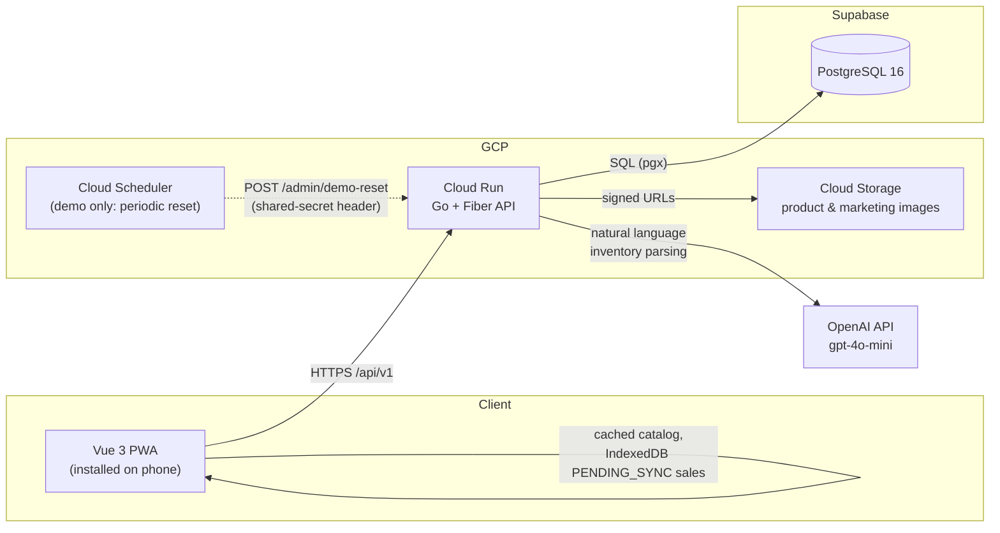

# BrewOps — public demo


This is the **public portfolio demo** of BrewOps, an inventory, sales, and
marketing management system built for a small juice and beverage business
operating in Mexico. Owners track stock, record sales from a point-of-sale
view, get low-stock alerts, and manage a gallery of product and promotional
images for WhatsApp — all from a phone-installable PWA that keeps working
without a stable internet connection.

This repo is a deliberately separated fork of the real product, wired up
specifically for public, unattended, repeated demoing. It is **not** the
codebase a paying business runs — see [`CLAUDE.md`](./CLAUDE.md)'s "DEMO
MODE" section for the exact, itemized list of what differs and why.

## Try it

> A live URL will be added here once this demo is deployed (Cloud Run +
> Supabase + a scheduled reset). Until then, run it locally — see "Local
> setup" below.

**Login credentials:**

| Email | Password |
|---|---|
| `demo@brewops.mx` | `Demo2026!` |

A few things to know before you click around:

- **Data resets periodically.** Whatever products, sales, or images you add
  or delete will be wiped back to a clean sample state on a schedule — don't
  treat anything you enter here as persistent.
- **The AI inventory assistant (`/inventory/suggest`) is rate-limited.** Each
  visitor gets a handful of tries per day, and the whole demo shares a small
  daily budget on top of that — both limits exist purely to bound the real
  OpenAI cost of a public, unauthenticated-feeling demo. Every other part of
  the app has no such limit.
- Everything else — inventory, sales, the POS flow, low-stock alerts,
  reports, the marketing gallery, offline mode — behaves exactly like the
  real product.

Want the fuller story behind why it's built this way? _(case study link —
coming soon)_

## Tech stack

| Layer | Technology |
|---|---|
| Backend | Go + [Fiber](https://gofiber.io/) |
| Frontend | Vue 3 + Vite + TypeScript |
| Database | PostgreSQL (Supabase in production) |
| Query layer | [sqlc](https://sqlc.dev/) — type-safe Go generated from raw SQL |
| Migrations | [golang-migrate](https://github.com/golang-migrate/migrate) |
| Auth | Manual JWT (`golang-jwt/jwt/v5`) |
| Image storage | GCP Cloud Storage |
| Hosting | GCP Cloud Run |
| IaC | Terraform |
| CI/CD | GitHub Actions |
| Charts | Chart.js via `vue-chartjs` |
| PWA | `vite-plugin-pwa` |

## Architecture



## Local setup

### Prerequisites

- Go 1.25+
- Node 22+ and [pnpm](https://pnpm.io/)
- Docker (for local Postgres)
- [golang-migrate](https://github.com/golang-migrate/migrate) CLI
- [sqlc](https://sqlc.dev/) CLI

### 1. Environment variables

```sh
cp backend/.env.example backend/.env
cp frontend/brew-ops/.env.example frontend/brew-ops/.env
```

Fill in the values you need locally — the defaults work as-is for Postgres
running via `docker-compose`. See each `.env.example` for what every
variable does, including the `DEMO_*`/`VITE_DEMO_MODE` ones this repo adds —
see `CLAUDE.md`'s "DEMO MODE" section.

### 2. Database

```sh
docker compose up -d postgres

cd backend
migrate -path db/migrations \
  -database "$DATABASE_URL" \
  up
```

Regenerate the type-safe query layer after changing anything in
`backend/db/queries/` or `backend/db/migrations/`:

```sh
sqlc generate
```

Load realistic sample data (products, 14 days of sales history, a marketing
gallery, and the demo admin account) with:

```sh
cd backend
go run ./cmd/seed
```

Safe to run again any time — it's idempotent, deleting and reinserting
business data rather than accumulating it. It never touches the demo admin
account's identity, only its password, so a repeated run doesn't invalidate
any existing session.

### 3. Backend

```sh
cd backend
go run ./cmd/server
```

`GET /health` reports server and database status.

### 4. Frontend

```sh
cd frontend/brew-ops
pnpm install
pnpm dev
```

## Offline mode (PWA)

BrewOps is designed to keep working at markets or events without stable
internet: the product catalog is cached by the service worker (`NetworkFirst`,
so an online request always sees the latest data — the cache is purely the
offline fallback), and sales recorded offline are queued in IndexedDB as
`PENDING_SYNC` until connectivity returns. A sale that fails to sync for
network reasons is retried; a sale that syncs but is rejected by business
rules (e.g. someone else already sold the last unit) is surfaced to the user
instead of being silently dropped or force-applied. See `CLAUDE.md` for the
full sync UX contract.

### Installing the PWA locally

The service worker only exists in a production build — `pnpm dev`'s dev
server never generates one, so offline mode can't be exercised against it.
To install and test it locally:

```sh
cd frontend/brew-ops
pnpm run build
pnpm run preview   # serves dist/ at http://localhost:4173
```

Open `http://localhost:4173` in Chrome, then use the install icon in the
address bar (or DevTools → Application → Manifest, which also confirms the
manifest itself has no errors). Once installed, DevTools → Network → Offline
(or literally disconnecting) lets you confirm: the product catalog stays
browsable, a sale made from the POS queues as "Pendiente de sincronizar" in
the sales history, and it syncs automatically once connectivity returns.

The backend's CORS_ALLOWED_ORIGINS must include `http://localhost:4173` for
the preview server to reach it — for a one-off manual check, run the backend
with
`CORS_ALLOWED_ORIGINS=http://localhost:4173,http://localhost:5173 go run ./cmd/server`.

## Testing

```sh
# Backend
cd backend && go test ./...

# Backend integration tests (need Postgres with migrations applied — see
# "Local setup" above)
cd backend && go test -tags=integration ./...

# Frontend
cd frontend/brew-ops && pnpm run lint && pnpm run build && pnpm run test

# End-to-end (Playwright) — requires Postgres running (docker compose up -d
# postgres); the backend and a production frontend build+preview are started
# automatically. See e2e/playwright.config.ts's backend env override for the
# CORS_ALLOWED_ORIGINS value it uses. Deep coverage on inventory/stock/sales,
# basic coverage on login/reports, per CLAUDE.md's E2E scope.
cd e2e && pnpm install && pnpm exec playwright install chromium && pnpm test
```
